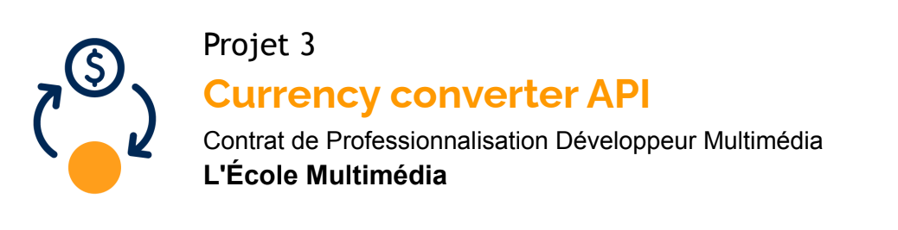

# Installation

- **API**

  ```
  cd api
  php artisan serve
  ```

  ▶️ Lancement de l'API sur le port 8000

- **Interface admin**

  ```
  cd admin
  npm install
  npm run dev
  ```

  (remplacez `dev` par `build` pour la production )

  📦 Installation des dépendances

  ▶️ Lancement de l'interface d'administration sur le port 5173

# Cahier des charges

## Analyse client

MoneyValue est une jeune entreprise en développement, opérant dans la finance. Du fait de la constante evolution du milieu, la mise en place de systèmes internes et modulaires est devenue une norme pour les entreprises de la fintech, ce qui motive la création de ce projet: une plateforme fiable, interne et sécurisée sur la quelle pourront s'appuyer les différentes applications de l'entreprise.

## Choix technologiques

Pour le développement de ce projet, la décision a été prise de se baser sur les technologies [Vue.js](https://vuejs.org/) pour la partie client, et [Laravel](https://laravel.com/) pour la partie API.

- **Vue JS**

  - **_Popularité et maintenance :_**
    Vue.js, est un framework JavaScript open-source utilisé pour construire des interfaces utilisateur et des applications web monopages. Grâce à sa communauté toujours plus active, Vue.js s'est fortement développé jusqu'à devenir une technologie de choix autant pour les petit projets que pour les projets de taille. D'après le [2023 Stackoverflow Survey](https://survey.stackoverflow.co/2023/#technology-most-popular-technologies) Vue JS se situe à la 8eme place des frameworks web et à la 5eme place des frameworks côté client.

  - **_Facilité d'utilisation et modularité :_**
    L'approche progressive de Vue JS permet de l'adopter progressivement dans des projets existants sans avoir à tout reconstruire. Avec une syntaxe simple et concise, il est facile de comprendre et de travailler avec. De plus, il possède un écosystème riche de modules officiels et de bibliothèques tierces.

  - **_Réactivité et performance_** : Grâce à son approche basée sur la réactivité, il facilite la création d'expériences utilisateur dynamiques, où les changements de données sont automatiquement reflétés dans l'interface sans avoir besoin de recharger la page.

- **Laravel**

  - **_Framework PHP populaire_** : Laravel est l'un des frameworks PHP les plus populaires et les plus utilisés de nos jours. Il dispose d'une vaste communauté de développeurs actifs, ce qui facilite la recherche de ressources, d'extensions et de support en cas de besoin.

  - **_Architecture MVC_** : Laravel suit le pattern de conception MVC (Modèle-Vue-Contrôleur), ce qui permet une séparation claire des responsabilités et une meilleure organisation du code. Cela facilite la maintenance, l'extensibilité et la réutilisabilité du code, ce qui est essentiel pour un projet à long terme comme celui-ci.

  - **_ORM puissant_** : Laravel intègre Eloquent, un ORM (Object-Relational Mapping) puissant qui simplifie l'interaction avec la base de données. Cela permet de manipuler les données et les requêtes de manière plus intuitive et plus expressive, sans avoir à écrire de requêtes SQL complexes.

  - **_Sécurité_** : Dans le domaine de la finance, la sécurité des données est primordiale. Laravel offre de nombreuses fonctionnalités de sécurité intégrées telles que le hachage de mots de passe, la protection CSRF (Cross-Site Request Forgery), la protection XSS (Cross-Site Scripting), etc. Il facilite également la mise en œuvre d'authentification et d'autorisation robustes pour contrôler l'accès aux ressources sensibles.

  - **_Routage et gestion des requêtes_** : Laravel propose un système de routage simple et puissant, qui permet de définir facilement les points d'entrée de l'API et de gérer les différentes requêtes HTTP (GET, POST, PUT, DELETE, etc.). Il offre également une prise en charge native de la pagination, ce qui est utile lorsque l'API doit gérer de grandes quantités de données.

  - **_Documentation complète_** : Laravel dispose d'une documentation complète et détaillée, ce qui facilite l'apprentissage et la compréhension du framework. La documentation fournit des exemples pratiques, des guides et des explications claires sur les fonctionnalités du framework, ce qui est précieux pour développer rapidement et efficacement l'API.

## Liste fonctionnelle & Evaluation du temps de travail

| **Feature**                                        | **Temps estimé** | **statut** |
| -------------------------------------------------- | ---------------- | ---------- |
| Rédaction du cahier des charges                    | 1 / 2 journée    | 🟢         |
| Création du diagramme de base de données           | 1h               | 🟢         |
| Création des maquettes                             | 1 / 2 journée    | 🔴         |
| Mise en place du projet                            | 2h               | 🟢         |
| Création des migrations et seeders (API)           | 1 / 2 journée    | 🟢         |
| Création des routes API et MEP de la documentation | 1 journée        | 🟢         |
| Création du systeme d'authentification             | 1 / 2 journée    | 🔴         |
| Création de l'interface d'administration           | 1 journée        | 🔴         |
| Relecture finale et MEP des livrables              | 1 / 2 journée    | 🔴         |

## Diagramme de la base de données


## Documentation de l’API

---

### 💱 Lire le statut de l'API

```
GET /status
```

- Reponse

  - Status : 🟢 200 OK

  - Body:

    ```
    {
      "status": 200,
      "message": "API Status : 🟢 OK"
    }
    ```

---

### 💱 Lister les devises

```
GET /currencies
```

- Exemple de reponse :

  - Status : 🟢 200 OK

  - Body:

    ```
    {
        "status": 200,
        "currencies": [
            {
                "id": 1,
                "name": "Euro",
                "code": "EUR"
            },
            {
                "id": 2,
                "name": "Dollar",
                "code": "USD"
            },
            {
                "id": 3,
                "name": "Bitcoin",
                "code": "BTC"
            },
            {
                "id": 4,
                "name": "Etherum",
                "code": "ETH"
            }
        ]
    }
    ```

- Erreurs possibles :

  - Pas de devises trouvées

    ```
    {
      "status": 404,
      "message": "No currencies found",
    }
    ```

---

### 💱 Lire une devise

```
GET /currencies/{id}
```

- Exemple de reponse :

  - Status : 🟢 200 OK

  - Body:

    ```
    {
      "status": 200,
      "currency": {
          "id": 6,
          "name": "Etherum",
          "code": "ETH"
      }
    }
    ```

- Erreurs possibles :

  - Pas de devises trouvées

    ```
      {
        "status": 404,
        "message": "No currencies found",
      }
    ```

---

### 💱 Créer une devise

```
POST /currencies
```

- **Exemple de requête (body) :**

```
{
  "name": "Etherum",
  "code": "ETH"
}
```

- Exemple de reponse :

  - Status : 🟢 200 OK

  - Body:

    ```
    {
      "name": "Etherum",
      "code": "ETH",
      "id": 4
    }
    ```

- Erreurs possibles :

  - Devise déjà existante

    ```
      {
        "status": 409,
        "message": "This currency already exists",
      }
    ```

  - Erreur de validation des données

    ```
      {
        "status": 422,
        "message": "Validation failed",
        "errors": {}
      }
    ```

---

### 💱 Mettre à jour une devise

```
PUT /currencies/{id}
```

- **Exemple de requête (body) :**

```
{
  "code": "QWE"
}
```

- Exemple de reponse :

  - Status : 🟢 200 OK

  - Body:

    ```
    {
      "name": "Etherum",
      "code": "QWE",
      "id": 4
    }
    ```

- Erreurs possibles :

  - Devise déjà existante

    ```
      {
        "status": 409,
        "message": "This currency already exists",
      }
    ```

  - Devise non trouvée

    ```
      {
        "status": 409,
        "message": "Currency not found",
      }
    ```

  - Erreur de validation des données

    ```
      {
        "status": 422,
        "message": "Validation failed",
        "errors": 4
      }
    ```

---

### 💱 Supprimer une devise

```
DELETE /currencies/{id}
```

- Exemple de reponse :

  - Status : 🟢 200 OK

  - Body:

    ```
    {
        "status": 200,
        "message": "Successfully deleted",
        "entry deleted": {
            "id": 6,
            "name": "Etherum",
            "code": "QWE"
        }
    }
    ```

- Erreurs possibles :

  - Devise non trouvée

    ```
      {
        "status": 409,
        "message": "Currency not found",
      }
    ```

---

### 💱 Lister les paires

```
GET /pairs
```

- Exemple de reponse :

  - Status : 🟢 200 OK

  - Body:

    ```
    {
        "status": 200,
        "pairs": [
            {
                "id": 1,
                "from_currency_id": 1,
                "to_currency_id": 2,
                "conversion_rate": "1.4000",
                "count": 0,
                "created_at": "2023-07-23T19:17:41.000000Z",
                "updated_at": "2023-07-23T19:17:41.000000Z"
            },
            {
                "id": 2,
                "from_currency_id": 1,
                "to_currency_id": 3,
                "conversion_rate": "1.2000",
                "count": 0,
                "created_at": "2023-07-23T19:18:59.000000Z",
                "updated_at": "2023-07-23T19:18:59.000000Z"
            },
        ]
    }
    ```

- Erreurs possibles :

  - Pas de paires trouvées

    ```
    {
      "status": 404,
      "message": "No pairs found",
    }
    ```

---

### 💱 Lire une paire

```
GET /pairs/from/{firstCurrencyId}/to/{secondCurrencyId}
```

- Exemple de reponse :

  - Status : 🟢 200 OK

  - Body:

    ```
    {
        "status": 200,
        "pair": [
            {
                "id": 5,
                "from_currency_id": 1,
                "to_currency_id": 5,
                "conversion_rate": "2.7000",
                "count": 0,
                "created_at": "2023-07-23T20:40:53.000000Z",
                "updated_at": "2023-07-23T20:40:53.000000Z"
            }
        ]
    }
    ```

- Erreurs possibles :

  - Pas de paires trouvées

    ```
    {
      "status": 404,
      "message": "No pairs found",
    }
    ```

---

### 💱 Lire le nombre de conversions pour une paire

```
GET /pairs/count/from/{firstCurrencyId}/to/{secondCurrencyId}
```

- Exemple de reponse :

  - Status : 🟢 200 OK

  - Body:

    ```
    {
        "status": 200,
        "data": {
            "count": 0
        }
    }
    ```

- Erreurs possibles :

  - Pas de paires trouvées

  ```
  {
    "status": 404,
    "message": "No pairs found"
  }
  ```

---

### 💱 Effectuer une conversion

```
POST /convert/{amount}/from/{currencyFrom}/to/{currencyTo}
```

- Exemple de requête :

  ```
  /convert/100/from/EUR/to/USD
  ```

- Exemple de reponse :

  - Status : 🟢 200 OK

  - Body:

    ```
    {
        "status": 200,
        "data": 140
    }
    ```

- Erreurs possibles :

---

### 💱 Créer une paire

```
POST /pairs
```

- **Exemple de requête (body) :**

```
{
  "from_currency_id": 1,
  "to_currency_id": 3,
  "conversion_rate": 1.4
}
```

- Exemple de reponse :

  - Status : 🟢 200 OK

  - Body:

    ```
    {
      "from_currency_id": 1,
      "to_currency_id": 3,
      "conversion_rate": 1.4,
      "updated_at": "2023-07-23T19:18:59.000000Z",
      "created_at": "2023-07-23T19:18:59.000000Z",
      "id": 2
    }
    ```

- Erreurs possibles

  - Paire existante
    ```
    {
      "status": 409,
      "message": "This pair already exists"
    }
    ```
  - Erreur de validation des données

    ```
      {
        "status": 422,
        "message": "Validation failed",
        "errors": {}
      }
    ```

---

### 💱 Mettre à jour une paire

```
PUT /pairs/{id}
```

- **Exemple de requête (body) :**

```
{
  "conversion_rate": "1.6000"
}
```

- Exemple de reponse :

  - Status : 🟢 200 OK

  - Body:

    ```
    {
        "status": 200,
        "pair modified": {
            "id": 7,
            "from_currency_id": 1,
            "to_currency_id": 3,
            "conversion_rate": 1.6000,
            "count": 0,
            "created_at": "2023-07-24T16:12:08.000000Z",
            "updated_at": "2023-07-24T16:12:47.000000Z"
        }
    }
    ```

- Erreurs possibles

  - Paire non trouvée

    ```
    {
        "status": 404,
        "message": "Pair not found"
    }
    ```

---

### 💱 Supprimer une paire

```
DELETE /pairs/{id}
```

- Exemple de reponse :

  - Status : 🟢 200 OK

  - Body:

    ```
    {
      "status": 200,
      "message": "Successfully deleted",
      "entry deleted": {
          "id": 7,
          "from_currency_id": 1,
          "to_currency_id": 3,
          "conversion_rate": "1.6000",
          "count": 0,
          "created_at": "2023-07-24T16:12:08.000000Z",
          "updated_at": "2023-07-24T16:12:47.000000Z"
      }
    }
    ```

- Erreurs possibles

  - Paire non trouvée

    ```
    {
        "status": 404,
        "message": "Pair not found"
    }
    ```

---

## Wireframe de la partie front de l’administration

Les images des wireframes de la partie administration
